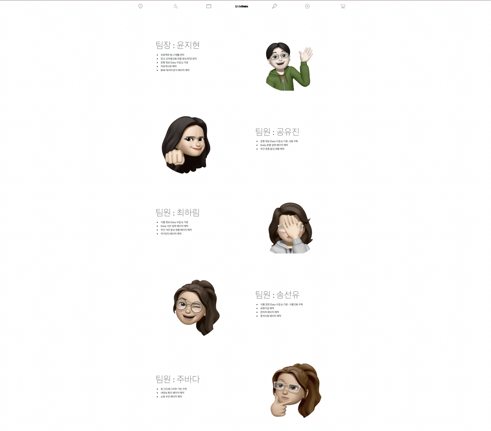
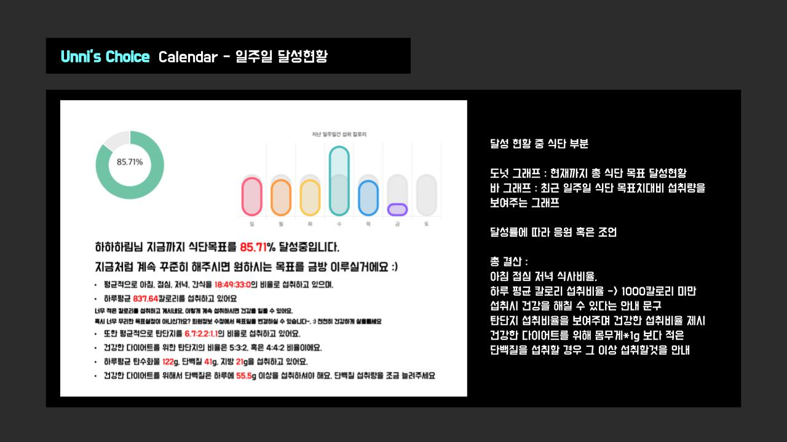
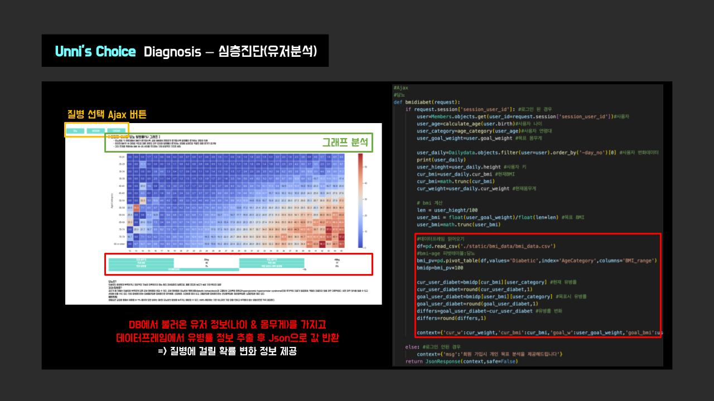

# Unnie's Choice
### 개발기간
2022.04 ~ 2022.06 (3개월)

### 개발 목적
1. 종래 각기 다른 어플리케이션에서 제공되던 식단관리 서비스와 운동관리 서비스를 하나의 웹페이지에서 통합 제공
2. 사용자의 신체 정보를 기반으로 평균 유병률을 기반으로 현재상태와 목표도달시의 유병률 비교 분석 제공

### 개발 환경
Python, Oracle Cloud, Django, HTML, JS

### 페이지 구성
</img>
</img>

### 주요 기능
1. 로그인
2. 식단 & 운동 입력
3. 개인 목표 도달 추세 분석
4. 신체 정보 기반 유병률 분석

### 제작 파트
</img>

### 개인 식단 관리
</img>

### BMI 기반 개인 유병율 분석
</img>